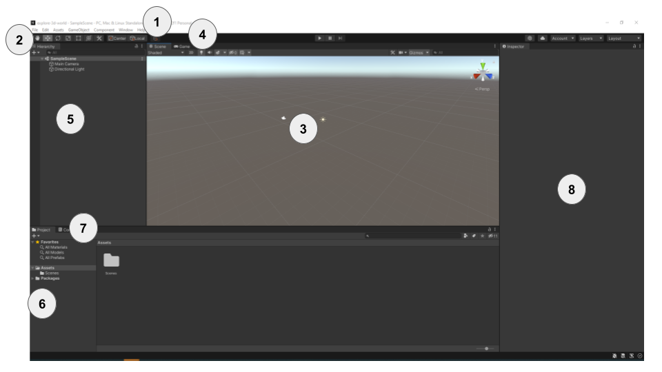

1. **The Unity Menu** - is used to import, open and save scenes and projects. You can amend your Unity Editor preferences and add new GameObjects and components.

2. **The Toolbar** - contains tools for navigating round in the Scene View, controlling play of the Game View and customising your Unity Editor layout.

### Unity views

It's really important to understand the difference between the Scene view and the Game view. 

3. **The Scene View** - is used to navigate and edit your Scene. You can select and position GameObjects including characters, scenery, cameras and lights.

4. **The Game View** - shows the scene as it looks through the lens of your cameras. When you click on the Play button to enter Playmode The Game View simulates your scene as it would be viewed by a user. Clicking the Play button again exits Playmode so you can continue editting your project.
 
### Unity windows

5. **The Hierarchy Window** - shows all the GameObjects in your Scene and the structure between them. You can add and navigate the GameObjects in your project. GameObjects can had child objects that move with them.

6. **The Project Window** - shows a library of all the files included in your project. You can find Assets to use here.

7. **The Console Window** - shows important messages. This is where you can see Compiler errors (errors in your Script) and messages that you print using `Debug.Log()`.

8. **The Inspector Window** - allows you to view and edit the properties of GameObjects. You can add other components to your GameObjects and edit the values they use.

